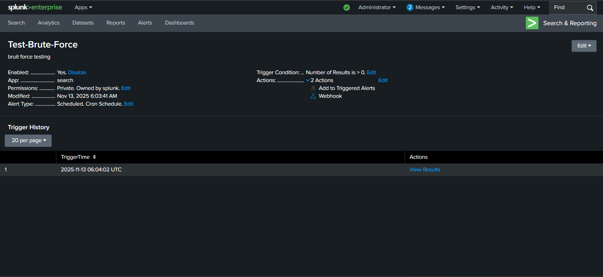

# SOC Aotomation with n8n – AI-Driven Alert Triage, Enrichment & Automated Response

This repository contains a fully functional Security Orchestration, Automation & Response (SOAR) pipeline built using Splunk, Splunk Universal Forwarder, n8n, Slack, and GPT-powered alert analysis.

The project automates Tier 1 SOC operations including:
- Alert ingestion
- Threat intelligence enrichment
- AI-driven analysis
- Automated escalation via Slack

The purpose is to demonstrate how SOAR can replace repetitive manual work with scalable, automated processes while keeping analysts focused on real threats.


---

## 📌 Features

### 🔹 Automated Alert Flow
- Windows event logs → Splunk UF → Splunk indexer
- Detection rules fire → data forwarded to n8n webhook

### 🔹 AI-Powered SOC Triage
- GPT evaluates alerts using a structured Tier 1 investigation workflow
- Produces summaries, MITRE mapping, severity scores, and recommended actions

### 🔹 Threat Intelligence Enrichment
- AbuseIPDB used for IP reputation scoring
- Easily extendable to additional OSINT modules (Shodan, VT, URLScan, IPinfo)

### 🔹 Slack Incident Notifications
- Automated SOC channel alerts
- Full AI-generated triage report sent to analysts in real time

### 🔹 Roadmap Extensions
- Integrating IRIS ticketing for case management
- Additional OSINT integrations
- Automated containment (disable accounts, block IPs, isolate hosts)

---

## 📁 Architecture Overview

```
Windows 10 VM  
     │
     ├── Splunk Universal Forwarder
     │        │
     │        └──→ Splunk Indexer (rules, alerts)
     │
Splunk Alert Action
     │
     └──→ n8n Webhook Trigger
                │
                ├── Extract IoCs
                ├── AbuseIPDB Reputation Check
                ├── GPT Alert Analysis
                ├── Report Builder
                └──→ Slack Notification
```


---

## 🛠️ Tech Stack

| Tool | Purpose |
|------|---------|
| **Splunk** | Log collection, detections, alerting |
| **Splunk Universal Forwarder** | Sends Windows logs to Splunk |
| **n8n** | SOAR workflow automation |
| **GPT Model** | Tier 1 alert triage |
| **AbuseIPDB API** | IP reputation enrichment |
| **Slack API** | Automated SOC alert delivery |
| **Windows 10 VM** | Source of security logs |

---

## 🚨 Splunk Configuration

### 1. Splunk Universal Forwarder

Forward Windows Security logs:

```ini
[WinEventLog://Microsoft-Windows-Sysmon/Operational]
index = my-project
disabled = false
renderXml = true
source = XmlWinEventLog:Microsoft-Windows-Sysmon/Operational

[WinEventLog://Microsoft-Windows-Windows Defender/Operational]
index = my-project
disabled = false
source = Microsoft-Windows-Windows Defender/Operational
blacklist = 1151,1150,2000,1002,1001,1000

[WinEventLog://Microsoft-Windows-PowerShell/Operational]
index = my-project
disabled = false
source = Microsoft-Windows-PowerShell/Operational
blacklist = 4100,4105,4106,40961,40962,53504

[WinEventLog://Application]
index = my-project
disabled = false

[WinEventLog://Security]
index = my-project
disabled = false

[WinEventLog://System]
index = my-project
disabled = false

[WinEventLog://Microsoft-Windows-TerminalServices-LocalSessionManager/Operational]
index = my-project
disabled = false
```

### 2. Splunk Alert Setup

Create a detection rule → configure it to call the n8n webhook.



---

## 🔄 n8n Workflow Breakdown

### 1. Webhook Trigger
Receives JSON payload from Splunk.

### 2. Data Extraction
Parses:
- Username
- Source IP
- Hostname
- Event code
- Timestamps

### 3. Threat Intelligence
- IP → AbuseIPDB
- Append threat score + categories into context

### 4. GPT-Based SOAR Analysis
Feeds the alert + enrichment into your custom Tier 1 prompt.

### 5. Slack Alert Delivery
- Severity indicator
- Summary
- MITRE mapping
- Recommendations

---

## 🔄 n8n Workflow Visual


---

## 🤖 GPT Prompt Used (Tier 1 SOAR Analyst)

```
Act as a Tier 1 SOC analyst assistant. When provided with a security alert or 
incident details (including indicators of compromise, logs, or metadata), 
perform the following steps:

1. Summarize the alert  
   - Provide a clear summary of what triggered the alert  
   - Identify affected systems, hosts, or usernames  
   - Describe the nature of the activity (e.g., suspicious login, malware detection, lateral movement)

2. Enrich with threat intelligence  
   - Correlate any IoCs (IP addresses, domains, hashes) with known malware or threat actors  
   - For IP enrichment, use the tool called "AbuseIPDB-Enrichment"  
   - Highlight if indicators are associated with suspicious or malicious behavior

3. Assess severity  
   - Map behaviors to MITRE ATT&CK techniques  
   - Rate severity (Low, Medium, High, Critical)

4. Recommend next actions  
   - Suggest investigation steps  
   - Suggest potential containment actions
```

---

## 📨 Slack Output Example

```
🚨 SOAR Alert – Severity: HIGH

Summary:
The alert "Test-Brute-Force" was triggered on the computer named "DESKTOP-8855LOF" involving the user "windows." The alert indicates that there were 8 brute force login attempts from the source IP address 192.168.1.106. This activity suggests a potential brute force attack aimed at gaining unauthorized access.
IOC Enrichment:
- Source IP: 192.168.1.106
  - This IP address is a private/internal IP (192.168.x.x) and is not publicly routable.
  - No reports of abuse or malicious activity are associated with this IP in the AbuseIPDB database.
  - IP is categorized as Reserved and is typical of local network devices.
Severity Assessment:
- MITRE ATT&CK Tactic: Initial Access (TA0001) and Credential Access (TA0006)
- Technique: Brute Force (T1110)
- Severity: Medium
  - Brute force attempts can lead to unauthorized access if successful.
  - The internal nature of the IP reduces immediate external threat but indicates possible internal compromise or testing.
Recommended Actions:
1. Investigate the source device with IP 192.168.1.106 to identify the user or process responsible for these login attempts.
2. Review authentication logs on "DESKTOP-8855LOF" for further suspicious activity or successful logins.
3. Ensure account lockout policies are in place to mitigate brute force attempts.
4. Monitor other network devices for similar activity.
5. If the source is found to be malicious or compromised, isolate the device and perform a thorough malware/compromise assessment.
6. Educate users on strong password practices and enforce multi-factor authentication if not already implemented.  
```


---

## 📅 Future Enhancements

### Near-term Improvements
- Integrate IRIS for automated ticket creation
- Add Shodan, Virustotal, IPinfo enrichment
- Add auto-containment with AD + firewall automation

---

## 🚀 Getting Started

### Prerequisites
- Splunk Enterprise or Free version
- Windows 10/11 VM for log generation
- n8n instance (self-hosted or cloud)
- AbuseIPDB API key
- OpenAI API key
- Slack workspace with webhook access

### Installation Steps

1. **Set up Splunk Universal Forwarder** on Windows VM
2. **Configure Splunk** indexer and detection rules
3. **Deploy n8n** workflow and configure webhook endpoint
4. **Set up API keys** for AbuseIPDB and GPT
5. **Configure Slack** webhook for notifications
6. **Test the pipeline** with sample security events

### Screenshots Directory Structure

```
SOC_Automation/
├── README.md
├── screenshots/
│   ├── input-configrations.png
│   ├── alert-formating.png
│   ├── splunk-alert-config.png
│   ├── n8n-workflow.png
│   └── slack-alert.png
└── workflows/
    └── n8n-soar-workflow.json
```

---

## 📝 License

This project is available for educational and research purposes.

---
